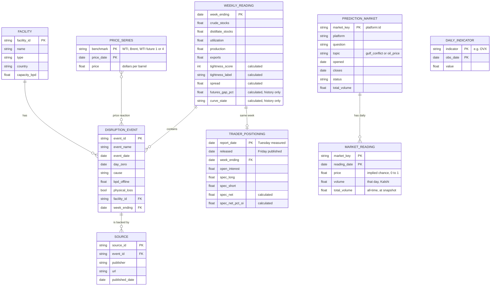

# Crude Market Tightness Monitor

A weekly read on how tight the US oil market is, set beside a global price gauge, for a fuel buyer deciding when to lock in a contract or review a hedge.

Data sources: U.S. Energy Information Administration (EIA); FRED, Federal Reserve Bank of St. Louis; CFTC; IMF PortWatch; Polymarket and Kalshi public market data; Caldara and Iacoviello Geopolitical Risk Index (CC BY).

> **This is a market monitoring and research tool. It does not give betting or trading recommendations.** It describes market conditions and how prices behaved in the past. It is a student project and is not investment advice.

**[Live showcase](https://domenicguanciale.github.io/crude-market-monitor/)** · built in Python with DuckDB, pandas, Plotly and Streamlit · 92 automated tests

## Key findings (October 5, 2026)

- **The US looks normal while the world is short.** US tightness reads +1 (normal), but the Brent minus WTI spread averaged **$23.51** in the latest week. US crude stocks sit near the top of their five-year range while distillates are 13% below normal.
- **The score does not forecast prices, and that is reported as found.** After tight weeks, WTI's four-week return was +0.45% against +0.77% for all weeks. The gap changes sign across non-overlapping samples.
- **Leaving 2020 out of the five-year range matters.** 2023 drops from 36 tight weeks to 12 and 2024 from 39 to 6. 2022 stays tight either way.
- **The futures curve agrees with the physical score.** 76% of tight weeks were in backwardation against a 30% base rate, and 90% of loose weeks in contango against 46%, over 2010 to April 2024.
- **Hormuz tanker transits fell about 98%:** from 50 a day (2019 to 2025) to about 1 a day from March 2026. The Strategic Petroleum Reserve fell from 413 to 284 million barrels.
- **Events are checked by hand before use.** 29 AI-drafted event rows, including a 14-row sourced timeline of the 2026 war, stay out of every analysis until checked. The accuracy rate will be reported.

## Contents

- [The question](#the-question)
- [What the monitor shows](#what-the-monitor-shows)
- [Method](#method)
- [Backtest: does the score say anything about the next four weeks?](#backtest-does-the-score-say-anything-about-the-next-four-weeks)
- [How abnormal years are treated](#how-abnormal-years-are-treated)
- [Futures curve: history only, ends April 2024](#futures-curve-history-only-ends-april-2024)
- [The 2026 Iran war as one episode](#the-2026-iran-war-as-one-episode)
- [The global side: chokepoints and the strategic reserve](#the-global-side-chokepoints-and-the-strategic-reserve)
- [Prediction markets: what traders priced in](#prediction-markets-what-traders-priced-in)
- [Unusual prediction market activity](#unusual-prediction-market-activity)
- [Trader positioning: large speculators in WTI](#trader-positioning-large-speculators-in-wti)
- [Oil volatility: OVX](#oil-volatility-ovx)
- [Geopolitical Risk Index, daily](#geopolitical-risk-index-daily)
- [Financial outcomes and the Monday read](#financial-outcomes-and-the-monday-read)
- [AI news reader](#ai-news-reader)
- [Public showcase](#public-showcase)
- [Ontology](#ontology)
- [Data](#data)
- [Limits](#limits)
- [Run it yourself](#run-it-yourself)
- [Files](#files)
- [Roadmap](#roadmap)

## The question

**When is the oil market tight, and how do prices react when supply is disrupted while it is tight?**

The monitor answers the first half: is the US market tight this week compared with normal for this time of year, and what do global prices, shipping and risk say? The second half, how prices react to disruptions, is the version 2 event study. Its inputs are built, and it starts once the event table has been hand-checked.

## What the monitor shows

1. **US tightness score**, from −3 (loose) to +3 (tight), labelled tight, normal or loose.
2. **Brent minus WTI spread**, a second gauge. Brent is the global benchmark and WTI is the US one, so a wide gap means the world is short while the US is comparatively well supplied.
3. **Charts.** Crude stocks, distillate stocks and refinery utilization each against their five-year range; the spread; US crude production for context. The local app adds a gauges section: Hormuz transits, the GPR index, OVX, CFTC positioning, the 10-year yield, the high-yield spread and the NASDAQ.
4. **The public showcase**, a replay of the 2026 disruption (see [Public showcase](#public-showcase)).

The two gauges always appear together. The score uses US data only, so on its own it could read "normal" in the middle of a global shortage. In late September 2026 that is exactly what happened: the score read normal while the spread was above $23.

## Method

### 1. Five-year seasonal comparison

Oil inventories rise and fall with the seasons, so a raw number means little. Each week is compared with the same week in earlier years.

1. Label each week-ending Friday with its ISO week number (1 to 53).
2. Take the values for that same week in the **prior five years**. The current year is left out. This matches EIA's own definition of its five-year range.
3. Compute the five-year low, high and average.
4. Compute where this week sits:

```
position   = (value - low) / (high - low)      0 at the five-year low, 1 at the high
pct_vs_avg = (value - average) / average
```

- **Abnormal years are skipped.** 2020 is never used as a comparison year. The range reaches one year further back instead, so it is always built from five values. See "How abnormal years are treated" below.
- **Week 53** is compared with week 52 of the prior years.
- **Missing years.** A week gets no result unless all five prior years have a value.
- **Why not a z-score.** A standard deviation from only five values is unreliable. Position in the range is simpler and more robust.

### 2. The tightness score

| Input | Tight when | +1 point | −1 point |
|---|---|---|---|
| Crude stocks, excluding the strategic reserve | Low | position below 0.25 | position above 0.75 |
| Distillate stocks (diesel and heating oil) | Low | position below 0.25 | position above 0.75 |
| Refinery utilization | High | position above 0.75 | position below 0.25 |

- Score = the sum of the three points. **Tight** at +2 or more, **loose** at −2 or less, otherwise **normal**.
- Weights are equal because there is no evidence yet for any other weighting.
- **Price is left out** because it is the outcome being explained. Putting it in would make "tight markets have high prices" true by construction.
- **Production is left out** because its direction is ambiguous: low output can mean a shortage or weak demand. It is shown as context only.

### 3. The spread

The weekly spread is the average of daily Brent minus WTI over the trading days in each Saturday-to-Friday week. Only days with both prices count. Averaging stops one unusual day from setting the whole week. For example, WTI fell to $85.23 on September 25, 2026 and recovered to $99.37 the next trading day.

## Backtest: does the score say anything about the next four weeks?

`backtest.py` follows METHODS.md section 3:
- Every week from 2010 is scored using the default range, with 2020 left out.
- Each score is dated to its Wednesday release, never the Friday the week ended, so the test uses only information that was public at the time.
- The return runs from the price on release day to the price four weeks later.

**Result: the score did not predict four-week price changes after tight weeks.**

| 2010 to 2026 | WTI: tight | WTI: loose | WTI: all | Brent: tight | Brent: loose | Brent: all |
|---|---|---|---|---|---|---|
| Weeks | 177 | 167 | 869 | 177 | 167 | 869 |
| Average four-week return | +0.45% | +4.87% | +0.77% | +0.71% | +5.51% | +0.92% |
| Median | +0.10% | +3.13% | +0.92% | −0.68% | +3.81% | +0.67% |
| Hit rate (share of rises) | 50% | 66% | 55% | 46% | 71% | 54% |

**Tight weeks.** After a tight week, prices did no better than after an average week.
- Average returns were within half a point of all weeks, and the hit rates were slightly lower.
- With 2026 left out, tight weeks did slightly *worse* than average: WTI −0.98% against +0.51%.
- **The every-fourth-week check**, which keeps windows from overlapping, gives about 40 tight windows. The tight-minus-all gap changes sign depending on which week the sampling starts on: +0.03%, −1.60%, −0.23% or +0.61% for WTI.
- A typical four-week move is about ±12%, so gaps this size are noise.

**Loose weeks.** After a loose week, prices rose more often than average. This is the more interesting finding, but it rests on very few episodes.
- 2020 alone contributes 37 loose weeks, with an average WTI return of +14.6%: the rebound from the pandemic low.
- Without 2020, loose weeks still averaged +2.1% for WTI (+3.1% for Brent), against +0.55% for all weeks. That is about one typical sampling error.
- Almost all loose weeks fall in four periods: 2010 to 2011, 2016 to 2017, 2020 and 2021. Each was a recovery from a price slump.
- So "loose stocks, then prices rise" is better read as prices recovering after a glut than as a usable signal.

**Checks.** Dating every release to Thursday, to allow for holiday weeks when EIA publishes a day late, gives the same picture: WTI tight +0.50% against all +0.76%. Tight weeks cluster in 2014, 2018, 2022, 2025 and 2026. The 2014 tight weeks were followed by that year's price collapse.

**What this means.** The score describes the physical market. It does not forecast prices, which fits METHODS.md section 7: supply conditions have historically explained less of oil price movement than demand and fear of shortage. The result is reported as found, and the method was not tuned after seeing it.

## How abnormal years are treated

**Rule: whole years marked abnormal in advance are left out of the five-year range, and the range reaches one year further back so it still holds five values. Single weeks are never removed.** The marked years are 2020 (pandemic) and 2026 (Strait of Hormuz closure). Marking 2026 has no effect until 2027, when it would first enter a five-year window. The list lives in `seasonal.ABNORMAL_YEARS` and was fixed before the backtest was run.

**Why 2020 is left out.** The range is meant to describe normal conditions. In 2020, stocks swelled and refineries ran far below normal. Keeping 2020 lowered the bar for "tight" in every year from 2021 to 2025, mostly through refinery utilization.

**What the choice changed.** These are tight weeks per year; `compare_2020.py` reproduces the full table. Only 2021 to 2025 can differ.

| Year | Tight weeks, 2020 kept (EIA-style range) | Tight weeks, 2020 left out (default) |
|---|---|---|
| 2021 | 24 | 4 |
| 2022 | 50 | 44 |
| 2023 | 36 | 12 |
| 2024 | 39 | 6 |
| 2025 | 46 | 31 |

- 107 of 1,613 scored weeks change label, and 100 of those move from tight to normal.
- Utilization drives most of the change: its average points for 2021 to 2025 fall from +0.57 to −0.02.
- 2022 is tight under either choice.

**Single abnormal weeks stay in.** Winter Storm Uri cut utilization to 56% in February 2021. That week sits at the low end of the utilization range through February 2026 and shows as a dip in the band each February. It is kept, because removing single weeks by judgment would invite cherry-picking.

## Futures curve: history only, ends April 2024

**There is no free live source for the WTI futures curve.**
- EIA's futures route still lists the contracts but stopped updating on April 5, 2024.
- FRED carries only spot prices.
- CME, the exchange, licenses its settlement data, and its pages could not be reached to confirm the terms.

So the curve is a **research comparison for 2010 to April 2024**, not a gauge. It is not shown on the live page.

**What it measures.** The gap between the nearest WTI futures contract and the fourth, as a share of the fourth, averaged over each week (`futures.py`).
- **Backwardation** means the near contract is priced above the later one: buyers pay up for oil now. It is a sign of tightness.
- **Contango** means the near contract is cheaper: oil now is plentiful. It is a sign of looseness.
- A gap within ±1% counts as flat. That band was fixed before looking at results, and a sign-only version is reported too.

**Result: the curve and the score mostly agree.** The curve gives a market-price view and the score a physical-inventory view, and they point the same way far more often than chance. `curve_history.py` reproduces this; it covers 745 weeks from 2010 to April 2024.

| | Score's weeks matching the curve | Base rate across all weeks |
|---|---|---|
| Tight weeks in backwardation | 76% (89% sign only) | 30% (40% sign only) |
| Loose weeks in contango | 90% (98% sign only) | 46% (60% sign only) |
| Opposite readings (tight in contango, or loose in backwardation) | 4% and 1% | |

- **The score is stricter than the curve.** Only 40% of backwardation weeks scored tight, and 44% of contango weeks scored loose. The curve often signals tightness when US stocks are merely normal.
- **Leaving out 2020 changes little.** Loose weeks in contango rise from 90% to 93%.
- **This fits the theory of storage.** When inventories are low, oil for immediate delivery commands a premium over later delivery. Price is still not an input to the score, so the agreement is a check on the score, not circular.
- **Caution.** Tight and loose weeks come in clusters, such as 2014, 2016, 2020 and 2022, so these 745 weeks are far fewer independent observations.

## The 2026 Iran war as one episode

`data/iran_war_2026.csv` is a dated timeline of the war as it affected oil markets, from the start of military action to the September escalation. It was built from starter rows E16 to E21 and the leads in EVENTS_NOTES.md. **Every row has a news-agency or official source. Wikipedia was used only as a pointer to dates.** Wording is neutral: dates, places, volumes and prices.

| Row | Date (alternative) | Event | Cause |
|---|---|---|---|
| W01 | Feb 28 | Military action begins; Hormuz tanker traffic largely stops (EIA: 7.5 million b/d shut in during March) | attack |
| W02 | Mar 2 (Mar 1) | Revolutionary Guards state the strait is closed; shipping lines suspend transits | blockade |
| W03 | Mar 7 | Kuwait declares force majeure and cuts output | blockade |
| W04 | Mar 13 (Mar 9) | Saudi Arabia cuts about 2 million b/d (Safaniya, Zuluf shut) | blockade |
| W05 | Mar 16 | UAE output falls by more than half | blockade |
| W06 | Mar 17 (Mar 20) | Iraq declares force majeure; Basra output from 3.3 to 0.9 million b/d | blockade |
| W07 | Apr 7 (Apr 8) | Two-week ceasefire; Iran agrees to reopen the strait | agreement |
| W08 | Apr 13 | US blockade of ships entering or leaving Iranian ports begins (CENTCOM) | blockade |
| W09 | Apr 17 | Iran declares the strait open to commercial vessels | agreement |
| W10 | Apr 21 | Ceasefire extended; blockade of Iranian ports kept | agreement |
| W11 | Jun 17 (Jun 18) | Islamabad memorandum signed | agreement |
| W12 | Jun 20 | Iran announces the strait closed again | blockade |
| W13 | Jul 7 (Jul 8) | Three tankers struck; US strikes follow the next day | attack |
| W14 | Sep 9 | Attacks on more than a dozen vessels; Brent closes above $100 on Sep 10 | attack |

- **Conflicting sources are recorded, not resolved.** Seven rows carry a `DATES DIFFER` or `PRICES DIFFER` flag with both values. For example, Iraq's force majeure letter is dated March 17 but was reported March 20.
- **One episode.** All rows share `episode = iran_war_2026`. Their windows overlap, so they are not independent observations. Every result is to be shown with and without the episode.
- **Nothing is hand-checked yet.** `events.py` loads the starter table and the war table (E16 to E21 are superseded by the W rows that cite them). Each row stays unchecked until you mark it `correct`, `corrected` or `could not confirm` in its CSV. Nothing downstream uses an unchecked row: the unusual-activity comparison, the event study and the showcase all filter on `hand_checked`. `events.py --report` prints progress and the accuracy rate of the AI-drafted rows.

## The global side: chokepoints and the strategic reserve

**Chokepoint transits.** `chokepoints.py` loads daily ship transits from **IMF PortWatch**, which counts ships from satellite AIS signals. It covers six oil chokepoints: Hormuz, Bab el-Mandeb, Suez, Malacca, the Cape of Good Hope and the Bosporus, daily from January 2019 to September 27, 2026.
- Each chokepoint is stored as a facility with its latitude and longitude, for the showcase map; daily counts go in `chokepoint_transit`.
- **Source and terms**, confirmed October 5, 2026: PortWatch's public ArcGIS services, no key. IMF data may be published and redistributed with attribution. Credit: IMF PortWatch (portwatch.imf.org).

| Average tankers per day | 2019 to 2025 | Feb 2026 | Mar 2026 | Jun 2026 | Sep 2026 |
|---|---|---|---|---|---|
| Strait of Hormuz | 50.2 | 43.5 | **0.9** | 5.4 | **1.0** |
| Cape of Good Hope | 13.0 | 13.5 | 17.7 | 20.1 | 17.7 |
| Malacca Strait | 75.6 | 85.6 | 76.0 | 69.7 | 69.9 |
| Bab el-Mandeb Strait | 17.8 | 13.8 | 15.0 | 13.8 | 7.9 |

- **Hormuz** tanker transits fell about 98% from March 2026 and have stayed between 1 and 5 a day.
- **The Cape of Good Hope** carried more tankers through the spring.

**Strategic Petroleum Reserve.** EIA weekly series `WCSSTUS1`, confirmed on the live API, is stored as `spr_stocks` on each weekly reading. It is context only, not part of the score. The reserve stood at **413 million barrels in early April 2026 and 284 million on September 25**, a drawdown of about 130 million barrels. Its record was 727 million in January 2010.

## Prediction markets: what traders priced in

`fetch_markets.py` collects public market data from **Polymarket** and **Kalshi** on two topics: the 2026 Gulf conflict, and crude oil price levels. Both sources were confirmed on the live service on October 5, 2026, and neither needs a key for market data. Prediction market prices are traders' implied chances, not facts or forecasts by this project.

**Which markets are included.** The rule was fixed before any prices were looked at (`prediction_markets.py`):
- **Topic.** The title is about the Gulf conflict or crude price levels, by keyword. Elections, leadership, sports, word-mention markets, Lebanon, Gaza, Ukraine and Russia are excluded.
- **Volume.** At least 10,000 in all-time volume: dollars on Polymarket, $1 contracts on Kalshi.
- **Period.** The market closes on or after January 1, 2026, and is open for at least 7 days. One-day markets have no history to compare against.

**What was collected on October 5, 2026**

| Platform | Topic | Markets | Daily readings | From |
|---|---|---|---|---|
| Polymarket | Gulf conflict | 834 | 24,544 | June 2025 |
| Polymarket | Oil price | 332 | 11,457 | Dec 2025 |
| Kalshi | Gulf conflict | 141 | 4,924 | Jan 2026 |
| Kalshi | Oil price | 214 | 5,352 | Mar 2026 |

1,374 of the 1,521 markets have already closed. Their history is kept because rows are only ever added or updated, never deleted.

**Two object types.** `prediction_market` has one row per market, and `market_reading` has one row per market per day.

**One calendar: US Eastern days.** A reading dated D is the market as of the end of D, New York time. The two platforms stamp days differently, and both had to be corrected:
- **Kalshi** stamps each daily candle with its *end* time, which is Eastern midnight, so a candle is filed under the day before its stamp.
- **Polymarket's** built-in daily points are 00:00 UTC snapshots, which is 8 p.m. Eastern the day before. Its prices are therefore fetched hourly, in 14-day ranges, and closed at Eastern midnight.

Tests cover both sides of the daylight-saving change.

**Data gaps**
- **Polymarket daily volume.** Polymarket publishes daily prices but only all-time volume. Each run saves the all-time total, so daily Polymarket volume can be measured only from October 5, 2026 onward.
- **Kalshi.** Kalshi gives daily volume for the full history. 922 Kalshi days have no price because nothing traded that day.

**Privacy.** Only market-level fields are stored, and the tests check that platform address fields never reach a table. No trade-level or account data is requested. Activity is reported in aggregate only.

## Unusual prediction market activity

`unusual_activity.py` flags days when prediction market odds or volume moved far more than usual. It reports **aggregate counts and rates only**: it does not identify, name or accuse any account. All rules are in `activity.py` and were fixed before any results were seen.

1. **A market is flagged on a day** when, against its own previous 30 days (at least 14 needed):
   - its odds moved at least 10 percentage points **and** at least 4 times its typical daily move; or
   - its volume was at least 5 times its typical day **and** at least 1,000.

   The last 2 days before a market closes are skipped, because odds jump to 0 or 1 as a question resolves.
2. **A day is unusual for a topic** when the share of that topic's active markets flagged that day is in the top 5% of days. Only days with at least 20 active markets count.
3. **Comparison with events.** For each hand-checked event: was there an unusual day 4 to 2 days before the event date? This is compared with the base rate for any day, and reported with and without the 2026 war episode. Day −1 is skipped because Gulf time runs 7 to 8 hours ahead of New York, so a reaction can land on New York's day −1.

**Results on October 5, 2026**

| | Market-days evaluated | Odds flags | Volume flags |
|---|---|---|---|
| Kalshi, Gulf conflict | 3,151 | 53 | 309 |
| Kalshi, oil price | 3,136 | 67 | 243 |
| Polymarket, Gulf conflict | 12,023 | 347 | no daily volume yet |
| Polymarket, oil price | 6,769 | 265 | no daily volume yet |

- **Gulf conflict.** 13 unusual days out of 245, each with at least 16.1% of active markets flagged. The most unusual were May 23, April 7, February 28 and June 11, 2026.
- **Oil price.** 12 unusual days out of 231, each with at least 20.4% of markets flagged. The most unusual were September 10, April 7, March 9 and February 2, 2026.
- **Event comparison: not run yet.** No events are hand-checked, and unchecked events are never used. The comparison runs automatically once events are marked checked.

**Reading these results.** An unusual day says only that markets moved together more than usual. Activity on or after an event is a reaction, not foresight. That is why the event comparison looks only at days 4 to 2 before, and always against the base rate.

## Trader positioning: large speculators in WTI

`cot.py` loads the CFTC's weekly **Commitments of Traders** report for NYMEX WTI crude, contract code 067651. The series is continuous from 1986 to today under three contract names. The source is the CFTC Public Reporting Environment (Legacy Futures Only report), confirmed live on October 5, 2026; it needs no key.

**What it measures.** In this report, "noncommercial" traders are the CFTC's large speculators: reportable traders who are not hedging. **Net speculative position = noncommercial long − noncommercial short**, also shown as a share of open interest so years with different market sizes compare fairly.

**Timing.** Positions are measured on Tuesday and published on Friday at 3:30 p.m. Eastern, so each row keeps both dates. Anything that tests timing must use `released`. In holiday weeks the CFTC measures on a Monday, Wednesday or Friday instead; the release date is then taken as the first Friday at least two days later.

**What it shows on October 5, 2026**
- Latest (positions September 29, released October 2): large speculators net long **109,463 contracts, 5.8% of open interest**. That is in the lowest 12% of weekly readings over the last five years.
- Net speculative length has fallen year by year, from an average of 24% of open interest in 2018 to 7% in 2025 and 2026.
- In 2026 it rose from 2.9% in early January to 9.9% in early April, then fell to 4.0% in early July. It has since recovered to about 6%.

This describes positioning. It is not a trading signal.

## Oil volatility: OVX

`fred.py` loads the **CBOE Crude Oil ETF Volatility Index (OVX)**, which measures the 30-day volatility that options traders expect in crude oil. It comes through the official FRED API, which needs a free `FRED_API_KEY` in `.env`. FRED's terms prohibit scraping, so the website's CSV links are not used.

**Copyright.** OVX belongs to the Chicago Board Options Exchange and appears on FRED with permission. It is used here for personal research only and is **not published** in the public showcase. Source: Chicago Board Options Exchange, CBOE Crude Oil ETF Volatility Index [OVXCLS], retrieved from FRED, Federal Reserve Bank of St. Louis.

**What it shows on October 5, 2026** (4,883 trading days, May 2007 to October 2, 2026)
- **Highest close on record:** 325 on April 21, 2020, the day after WTI went negative.
- **2026 high:** 120.9 on March 11. That is the highest since 2020, and the monthly average peaked at 95 in March.
- **Since then:** volatility eased through April (average 80) and May (71), and has held at 50 to 57 since June.
- **Latest:** 51.0 on October 2, about 1.5 times the 2010 to 2025 median of 34. Options traders still expect larger-than-usual swings.

## Geopolitical Risk Index, daily

`gpr.py` loads the daily **Geopolitical Risk (GPR) Index** of Caldara and Iacoviello. It counts articles about geopolitical tension in 10 major newspapers, scaled so that 1985 to 2019 averages 100. Two sub-indexes split the articles into **acts**, such as attacks and war, and **threats**, such as warnings and buildups.

**Source and licence.** The daily Stata file from https://www.matteoiacoviello.com/gpr.htm, confirmed on October 5, 2026. It needs no key and is updated every Monday. The data is open access under **Creative Commons BY**, so it may be published with credit. Cite: Caldara, Dario and Matteo Iacoviello (2022), "Measuring Geopolitical Risk," *American Economic Review* 112(4), 1194–1225. Data downloaded from https://www.matteoiacoviello.com/gpr.htm on October 5, 2026.

**Timing.** A value on day D reflects articles *published* on D, which often report events from D−1. Allow for that when lining it up with events.

**What it shows** (15,253 days, January 1985 to October 5, 2026)
- **Record highs** are in late September 2001, peaking at 1,046.
- **Yearly averages** rose from about 80 in 2020 and 2021 to 153 in 2022. **2026 averages 188**, the highest year since 2019.
- **In 2026**, the monthly average jumped from 117 in February to **325 in March**, with acts at 443, more than four times the long-run normal. It then fell back to 244 in April, 200 in May and 123 in August. September averaged 166.
- **The last 30 days** averaged 167, about 1.7 times the long-run baseline.

## Financial outcomes and the Monday read

**Three daily outcome series** for the version 2 event study ("how did tech funding costs react?") come through the FRED API (`fred.py`):

| Series | FRED id | Coverage | Terms |
|---|---|---|---|
| NASDAQ Composite | `NASDAQCOM` | 1971 to today | © Nasdaq. Personal research only, not published |
| 10-year Treasury yield | `DGS10` | 1962 to today | Federal Reserve H.15, public domain. Publishable |
| ICE BofA US High Yield spread | `BAMLH0A0HYM2` | **October 6, 2023** to today | © ICE: reproduction prohibited without permission. FRED keeps only the last three years |

**Monday summary.** `monday_summary.py` writes `reports/monday_<date>.md` with the latest reading of every gauge, each with its own as-of date: the score, the spread, the reserve, Hormuz transits, GPR, OVX, CFTC positioning, prediction markets tracked, and the three outcome series. It is the weekly post described in the brief: levels and changes, no forecasts.

## AI news reader

`news_reader.py` turns a pasted news article into a **proposed** disruption event for you to review. It never writes to the events table on its own.

1. **`stage`** turns an extraction into a **pending** row in `staged_event`. The extraction is a fixed set of fields: event date, facility, country, cause, product, whether barrels were lost, barrels per day offline, and short verbatim evidence quotes. It is validated against a schema either way. There are two ways to produce it:
   - **No API key (the default here).** Paste the article to Claude in a Claude Code session. Claude writes the extraction to a JSON file in `staging/`, which is not committed, and runs `stage --extraction staging/<file>.json`.
   - **Optional API path.** With `ANTHROPIC_API_KEY` in `.env`, `stage --file article.txt` calls `claude-opus-5-5` itself through the official `anthropic` SDK.
2. **`show`**, **`list`** and **`edit`** let you review the row and correct any field. Edits are checked against the same rules.
3. **`approve`** prints the row and writes it to `disruption_event`, with its facility and source, **only after you type "yes"**. Rows are stored as **not hand-checked** unless you pass `--checked` after verifying them against the source. **`reject`** keeps the row for the record.

**Rules built into the prompt and the code**
- Neutral wording: dates, volumes and prices only, with no characterisation of any party.
- The date is when the event happened, not when the article was published.
- No estimated barrel figures; the cause must come from the event table's own list.
- The article is treated as untrusted data: instructions inside it are ignored.
- The article text is not stored, only quotes of 25 words or fewer.
- If a safety classifier declines, the API retries on Anthropic's recommended fallback model (`fallbacks: "default"`). If that also declines, nothing is staged.

**Setup.** The default path needs no key. The optional API path needs `ANTHROPIC_API_KEY` in `.env`; keys come from https://console.anthropic.com, billed per use, roughly 1 to 5 cents per article.

**Demonstration.** EIA's public-domain article on the 2019 Abqaiq outage was staged as row 1 and left pending for review. The article gives Abqaiq's capacity (7 million b/d) and its output on September 17 (2 million b/d), but never states the barrels taken offline. Under the no-estimate rule, `capacity_offline_bpd` stays empty, with a note saying another source is needed.

```bash
.venv/bin/python news_reader.py stage --extraction staging/eia-41413-abqaiq.json --url https://www.eia.gov/todayinenergy/detail.php?id=41413 --publisher "EIA Today in Energy"
.venv/bin/python news_reader.py show 1
.venv/bin/python news_reader.py edit 1 capacity_offline_bpd=2000000
.venv/bin/python news_reader.py approve 1 --episode iran_war_2026
```

## Public showcase

`docs/index.html` is a static page for GitHub Pages: no server and no keys. It reads `docs/data/showcase.json`, written by `export_showcase.py`.

- **This week's reading:** the score, the spread, and the three positions in the five-year range.
- **A replay of the 2026 disruption.** Play/pause and a scrubber run over stacked charts on one time axis: Brent and WTI, the spread, the 10-year Treasury yield, Hormuz tanker transits, and the Geopolitical Risk Index. As the playhead reaches each hand-checked event, a marker runs through every chart, a card shows the date, barrels offline and source, and the event lights up on a map. Clicking an event zooms every chart to 5 trading days before and 20 after, rescaled to 100 on day zero (or shown as a change, for yields and spreads). The page states that it shows what moved together, not what caused what.
- **A toggle** between the score with and without 2020 in the five-year range, the **backtest result** stated plainly, and **method and limits**.

**Publishing rules are enforced by the export, and tested.**
- Only series cleared for republication leave the machine: EIA, CFTC and Federal Reserve data are public domain, and IMF PortWatch and the GPR index allow it with credit.
- The **NASDAQ Composite and the ICE BofA high-yield spread are not shown** because their owners do not permit republishing; they are charted in the local Streamlit app. OVX and prediction market data stay local too.
- **Only hand-checked events are exported.** Until rows are checked, the replay shows prices, shipping and risk with no event markers.

Tested in light and dark mode and at phone width (no sideways scrolling), with the replay, the event zoom and the map exercised.

## 3D view

`docs/3d.html` ([live](https://domenicguanciale.github.io/crude-market-monitor/3d.html)) shows three linked views driven by one time slider. See `3D_VIEW.md` for details.
- **Globe:** tanker traffic at six chokepoints as pillars, each with a ring at its own 2019 to 2025 median.
- **Skyline:** thirty years of the weekly tightness score, with the 2020 switch.
- **Hormuz close-up:** one moving ship per daily tanker transit on a real coastline.

Data comes from `docs/data/viz3d.js`, written by `export_3d.py` under the same publishing rules as the showcase. `tools/check_lanes.py` confirms every drawn shipping lane stays in open water.

**What the 3D page does not claim**
- Ship positions, routes and directions are a display choice. The data has daily counts, not vessel tracks or origins, so every ship has the same colour.
- Facility pins appear only for facilities tied to a hand-checked event.

## Ontology

Each object type is its own DuckDB table. `weekly_reading`, `price_series`, `prediction_market` and `market_reading` are filled. `facility`, `disruption_event` and `source` wait for the hand-checked event table. Full detail is in [ONTOLOGY.md](ONTOLOGY.md).



- **Calculated properties:** the tightness score and the Brent minus WTI spread on each weekly reading. The futures curve gap and curve state are calculated too, but only through April 5, 2024 (history only).
- **Action (version 2):** "Flag hedge review" fires when the score is tight and a new disruption is logged, and alerts the buyer.

## Data

Seven live EIA series and two history-only futures series. Every route and series ID was confirmed against the live API with `check_routes.py` before use. The script also prints each series' latest date, because a series can stay listed after EIA stops updating it.

| What | EIA series | Units | Route |
|---|---|---|---|
| WTI spot price, Cushing | `RWTC` | $/barrel, daily | `petroleum/pri/spt` |
| Brent spot price | `RBRTE` | $/barrel, daily | `petroleum/pri/spt` |
| Crude stocks excluding SPR | `WCESTUS1` | thousand barrels | `petroleum/stoc/wstk` |
| Distillate fuel stocks | `WDISTUS1` | thousand barrels | `petroleum/stoc/wstk` |
| Refinery utilization | `WPULEUS3` | % of operable capacity | `petroleum/pnp/wiup` |
| Crude production | `WCRFPUS2` | thousand barrels/day | `petroleum/sum/sndw` |
| Crude exports | `WCREXUS2` | thousand barrels/day | `petroleum/move/wkly` |
| Strategic Petroleum Reserve crude stocks (context) | `WCSSTUS1` | thousand barrels | `petroleum/stoc/wstk` |
| WTI futures, contract 1 (history only) | `RCLC1` | $/barrel, daily, ends Apr 5, 2024 | `petroleum/pri/fut` |
| WTI futures, contract 4 (history only) | `RCLC4` | $/barrel, daily, ends Apr 5, 2024 | `petroleum/pri/fut` |

EIA releases the weekly figures on Wednesdays, for the week that ended the previous Friday. Scores start in November 1995, the first week with five full prior years for all three inputs.

## Limits

From METHODS.md section 8. Items marked *(later version)* describe parts of the project not built yet.

- The score uses US data only and measures US conditions, not global ones.
- Brent here is EIA's **spot** price for physical cargoes. In 2026 it has often run far above Brent futures quoted in the news (for example $114 to $120 spot against roughly $92 to $103 futures in late September). One-day spikes in EIA's series, such as $135.51 on October 2, 2026 (+18%, with WTI flat), are kept as published but could not be confirmed in news reports. The weekly spread averages over the week, which softens single-day spikes.
- No free live source was found for the futures curve. The curve comparison is history only and ends April 5, 2024.
- OVX, and later the NASDAQ index and the high-yield spread, are third-party copyrighted on FRED. They are used for personal research and are not published in the showcase.
- The GPR index counts newspaper coverage. It measures attention to geopolitical tension, not the tension itself, and its articles often describe the previous day.
- News reader extractions are proposals from a language model and can be wrong. Every row is reviewed before approval and stays "not hand-checked" until verified against its source.
- PortWatch counts ships from AIS signals. Ships that switch off their transponders are missed, which matters most in a conflict zone.
- Prediction market prices reflect what traders on two platforms were willing to pay. They are not probabilities this project endorses. Polymarket daily volume exists only from October 5, 2026.
- Unusual-activity days show markets moving together. They do not show who traded or why, and activity on or after an event is a reaction. Days near the 20-market minimum rest on small counts.
- Weekly figures are estimates and are sometimes revised. The backtest uses revised data, not the first figures people saw at the time.
- Forward windows overlap, which overstates how much evidence there is. The every-fourth-week check is reported alongside.
- Tight and loose weeks come in clusters, so a handful of episodes drive the backtest result.
- The event table is small, and other news moves prices on the same days. *(Event study: version 2)*
- The 2026 Strait of Hormuz episode is far larger than any other event and dominates averages. Results are shown with and without it. *(Event study: version 2)*
- The event tables were drafted with AI assistance. Every row must be hand-checked before it is used, and the accuracy rate is reported by `events.py --report`. *(Checking in progress: 0 of 29 so far.)*
- The tool describes how prices reacted in the past. It does not forecast when disruptions happen or what prices will do.
- This is a market monitoring and research tool, not betting or trading advice. It is a student project and is not investment advice.

## Run it yourself

You need Python 3.13, a free EIA API key from https://www.eia.gov/opendata/register.php, and a free FRED API key from https://fredaccount.stlouisfed.org.

```bash
python3 -m venv .venv
.venv/bin/pip install -r requirements.txt
```

Create a file named `.env` in the project folder with the lines `EIA_API_KEY=your_key` and `FRED_API_KEY=your_key`, plus `ANTHROPIC_API_KEY=your_key` only if you use the news reader's optional API path. Git ignores this file, so the key never gets committed.

```bash
.venv/bin/python check_routes.py   # confirm every series is on its route
.venv/bin/python fetch.py          # download the seven series into DuckDB
.venv/bin/python calculate.py      # five-year comparison, score, and spread
.venv/bin/python backtest.py       # backtest (METHODS.md section 3)
.venv/bin/python curve_history.py  # futures curve vs score, history only
.venv/bin/python fetch_markets.py  # prediction market odds (no key needed); re-run daily, about 3 minutes
.venv/bin/python unusual_activity.py  # unusual activity, aggregate only
.venv/bin/python cot.py            # CFTC positioning; new data each Friday
.venv/bin/python fred.py           # OVX and other daily series (needs FRED_API_KEY)
.venv/bin/python gpr.py            # Geopolitical Risk Index; updated each Monday
.venv/bin/python chokepoints.py    # chokepoint transits (IMF PortWatch)
.venv/bin/python monday_summary.py # the Monday read
.venv/bin/python events.py         # load the event tables; --report for checking progress
.venv/bin/streamlit run app.py     # open the page
.venv/bin/python -m unittest discover -s tests -t .   # run the tests
.venv/bin/python update.py         # or: refresh everything above in order, then rebuild the showcase
.venv/bin/python export_3d.py      # 3D page data; then tools/check_lanes.py
```

Re-run `fetch.py` and `calculate.py` after each Wednesday EIA release.

## Files

| File | What it does |
|---|---|
| `eia.py` | Reads the key from `.env`, calls the EIA API, pages through long series |
| `check_routes.py` | Confirms each series ID exists on its route before anything is fetched |
| `db.py` | The DuckDB schema: one table per ontology object type |
| `fetch.py` | Downloads the seven live series and the two history-only futures series |
| `seasonal.py` | Five-year comparison (METHODS.md section 1) |
| `score.py` | Tightness score and weekly spread (METHODS.md section 2) |
| `calculate.py` | Runs the comparison, score, and spread and saves them |
| `compare_2020.py` | Shows what leaving 2020 out of the range changes |
| `backtest.py` | Four-week price changes after tight, loose, and all weeks |
| `futures.py` | Futures curve gap and backwardation/contango state (history only) |
| `curve_history.py` | How often the curve agreed with the score, 2010 to April 2024 |
| `prediction_markets.py` | Polymarket and Kalshi clients and the market selection rule |
| `fetch_markets.py` | Saves prediction market odds; add or update only, never delete; re-runs fetch only recent days |
| `activity.py` | Unusual-activity rules: market-day flags, unusual topic-days, event window |
| `unusual_activity.py` | Aggregate report of unusual days and the comparison with hand-checked events |
| `cot.py` | CFTC Commitments of Traders for WTI: large speculators' net position |
| `fred.py` | Daily series from the FRED API, with each series' owner and publishing terms |
| `gpr.py` | Daily Geopolitical Risk Index, with acts and threats sub-indexes (CC BY) |
| `monday_summary.py` | Short Monday read of every gauge, for the weekly post |
| `events.py` | Loads the starter and war event tables; reports hand-checking progress and accuracy |
| `data/iran_war_2026.csv` | The 2026 Iran war timeline, sourced, one episode, not yet hand-checked |
| `chokepoints.py` | Daily ship transits through six oil chokepoints (IMF PortWatch) |
| `news_reader.py` | AI news reader: stages events extracted by Claude; writes only after you approve |
| `app.py` | The Streamlit page |
| `export_3d.py` | Writes the 3D page data: publishable series, two versions of the score, coastline, schematic lanes |
| `tools/check_lanes.py` | Confirms every schematic lane stays in open water |
| `docs/3d.html` | The 3D page (Three.js 0.160.0 from jsDelivr) |
| `export_showcase.py` | Writes the public showcase data: publishable series and hand-checked events only |
| `docs/index.html` | The static showcase page (GitHub Pages) |
| `update.py` | Runs every loader in order, then the showcase export and the Monday read |
| `tests/` | Tests for every calculation and rule: schema, API paging, comparison, score, backtest, futures, prediction markets, unusual activity, positioning, news reader, events, export |

## Roadmap

| Version | Adds |
|---|---|
| 1 | This monitor |
| 1.5 | Backtest (done, results above) |
| 2 | Supply Disruption Event Study: one event study with two questions, how oil prices and how tech funding costs reacted to each hand-checked disruption, plus a map. Not started until the event table is hand-checked |
| Expansion | Futures curve (history), prediction markets and unusual activity, CFTC positioning, OVX, GPR, AI news reader, chokepoints and SPR, outcome series, Monday read, war timeline, public showcase (done) |
| 3 | Rebuild in Palantir Foundry |

