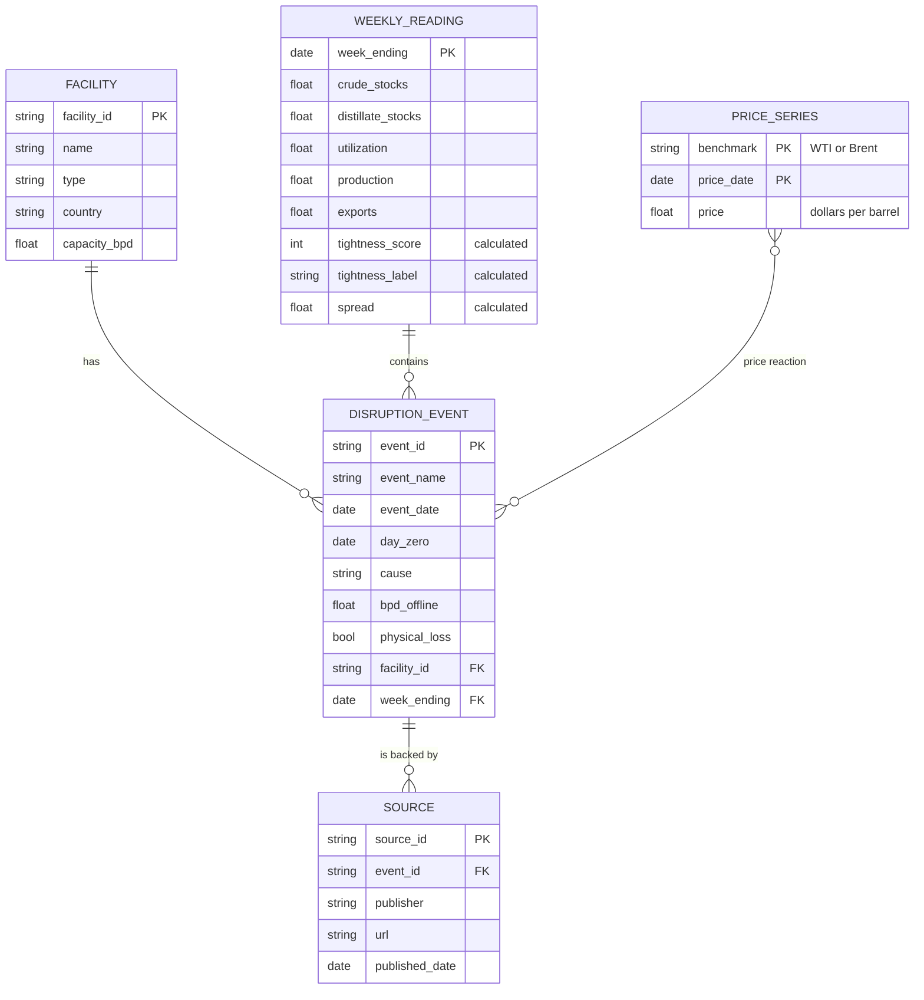

# Crude Market Tightness Monitor

A weekly read on how tight the US oil market is, set beside a global price gauge, for a fuel buyer deciding when to lock in a contract or review a hedge.

Data source: U.S. Energy Information Administration (EIA).

## The question

**When is the oil market tight, and how do prices react when supply is disrupted while it is tight?**

Version 1 answers the first half: is the US market tight this week compared with normal for this time of year, and what does the global price gap say? The second half, how prices react to disruptions, is version 2.

## What the monitor shows

1. **US tightness score**, from −3 (loose) to +3 (tight), labelled tight, normal or loose.
2. **Brent minus WTI spread**, a second gauge. Brent is the global benchmark and WTI is the US one, so a wide gap means the world is short while the US is comparatively well supplied.
3. **Five charts.** Crude stocks, distillate stocks and refinery utilization each against their five-year range. The spread over time. US crude production for context.

The two gauges always appear together. The score uses US data only, so on its own it could read "normal" in the middle of a global shortage. In late September 2026 that is exactly what happened: the score read normal while the spread was above $23.

## Method

### 1. Five-year seasonal comparison

Oil inventories rise and fall with the seasons, so a raw number means little. Each week is compared with the same week in earlier years.

1. Label each week-ending Friday with its ISO week number (1 to 53).
2. Take the values for that same week in the **prior five years**. The current year is left out. This matches EIA's own definition of its five-year range.
3. Compute the five-year low, high and average.
4. Compute where this week sits:

```
position   = (value - low) / (high - low)      0 at the five-year low, 1 at the high
pct_vs_avg = (value - average) / average
```

- **Week 53** is compared with week 52 of the prior years.
- **Missing years.** A week gets no result unless all five prior years have a value.
- **Why not a z-score.** A standard deviation from only five values is unreliable. Position in the range is simpler and more robust.

### 2. The tightness score

| Input | Tight when | +1 point | −1 point |
|---|---|---|---|
| Crude stocks, excluding the strategic reserve | Low | position below 0.25 | position above 0.75 |
| Distillate stocks (diesel and heating oil) | Low | position below 0.25 | position above 0.75 |
| Refinery utilization | High | position above 0.75 | position below 0.25 |

- Score = the sum of the three points. **Tight** at +2 or more, **loose** at −2 or less, otherwise **normal**.
- Weights are equal because there is no evidence yet for any other weighting.
- **Price is left out** because it is the outcome being explained. Putting it in would make "tight markets have high prices" true by construction.
- **Production is left out** because its direction is ambiguous: low output can mean a shortage or weak demand. It is shown as context only.

### 3. The spread

The weekly spread is the average of daily Brent minus WTI over the trading days in each Saturday-to-Friday week. Only days with both prices count. Averaging stops one unusual day from setting the whole week. For example, WTI fell to $85.23 on September 25, 2026 and recovered to $99.37 the next trading day.

## Ontology

Each object type is its own DuckDB table. Version 1 fills `weekly_reading` and `price_series`. The other three tables exist but stay empty until version 2. Full detail is in [ONTOLOGY.md](ONTOLOGY.md).



- **Calculated properties:** the tightness score and the Brent minus WTI spread on each weekly reading.
- **Action (version 2):** "Flag hedge review" fires when the score is tight and a new disruption is logged, and alerts the buyer.

## Data

Seven EIA weekly and daily series. Every route and series ID was confirmed against the live API with `check_routes.py` before use.

| What | EIA series | Units | Route |
|---|---|---|---|
| WTI spot price, Cushing | `RWTC` | $/barrel, daily | `petroleum/pri/spt` |
| Brent spot price | `RBRTE` | $/barrel, daily | `petroleum/pri/spt` |
| Crude stocks excluding SPR | `WCESTUS1` | thousand barrels | `petroleum/stoc/wstk` |
| Distillate fuel stocks | `WDISTUS1` | thousand barrels | `petroleum/stoc/wstk` |
| Refinery utilization | `WPULEUS3` | % of operable capacity | `petroleum/pnp/wiup` |
| Crude production | `WCRFPUS2` | thousand barrels/day | `petroleum/sum/sndw` |
| Crude exports | `WCREXUS2` | thousand barrels/day | `petroleum/move/wkly` |

EIA releases the weekly figures on Wednesdays, for the week that ended the previous Friday. Scores start in November 1995, the first week with five full prior years for all three inputs.

## How abnormal years are treated

Abnormal years are **kept in the five-year range**, which is the default in METHODS.md. Their effect is stated here, not removed.

- **2020 (pandemic).** Stocks swelled and refineries idled, so 2020 widens the range for every week from 2021 to 2025. That widening makes later weeks look tighter: 2022 scored tight in 50 of 52 weeks and 2025 in 46. Part of that is real, with low distillate stocks and busy refineries. Part is the method. A version that drops 2020 is the planned check.
- **February 2021 (Winter Storm Uri).** Utilization fell to 56% in one week, and that week sits in the low end of the utilization range through February 2026. It is visible as a sharp dip in the band each February.
- **2026 (Strait of Hormuz closure).** It is in the current data. From 2027 on, it will sit inside the five-year window the same way 2020 does.

## Limits

From METHODS.md section 8. Items marked *(later version)* describe parts of the project not built yet.

- The score uses US data only and measures US conditions, not global ones.
- Weekly figures are estimates and are sometimes revised. The backtest uses revised data. *(Backtest: version 1.5)*
- Forward windows overlap, which overstates how much evidence there is. *(Backtest: version 1.5)*
- The event table is small, and other news moves prices on the same days. *(Event study: version 2)*
- The 2026 Strait of Hormuz episode is far larger than any other event and dominates averages. Results are shown with and without it. *(Event study: version 2)*
- The event table was drafted with AI assistance and hand-checked. The accuracy rate is reported. *(Version 2. Not yet checked.)*
- The tool describes how prices reacted in the past. It does not forecast when disruptions happen or what prices will do.
- This is a student project and is not investment advice.

## Run it yourself

You need Python 3.13 and a free EIA API key from https://www.eia.gov/opendata/register.php.

```bash
python3 -m venv .venv
.venv/bin/pip install -r requirements.txt
```

Create a file named `.env` in the project folder with one line, `EIA_API_KEY=your_key`. Git ignores this file, so the key never gets committed.

```bash
.venv/bin/python check_routes.py   # confirm every series is on its route
.venv/bin/python fetch.py          # download the seven series into DuckDB
.venv/bin/python calculate.py      # five-year comparison, score, and spread
.venv/bin/streamlit run app.py     # open the page
.venv/bin/python -m unittest discover -s tests -t .   # run the tests
```

Re-run `fetch.py` and `calculate.py` after each Wednesday EIA release.

## Files

| File | What it does |
|---|---|
| `eia.py` | Reads the key from `.env`, calls the EIA API, pages through long series |
| `check_routes.py` | Confirms each series ID exists on its route before anything is fetched |
| `db.py` | The DuckDB schema: one table per ontology object type |
| `fetch.py` | Downloads the seven series and stores them |
| `seasonal.py` | Five-year comparison (METHODS.md section 1) |
| `score.py` | Tightness score and weekly spread (METHODS.md section 2) |
| `calculate.py` | Runs the comparison, score, and spread and saves them |
| `app.py` | The Streamlit page |
| `tests/` | Tests for the schema, the API paging, the comparison, and the score |

## Roadmap

| Version | Adds |
|---|---|
| 1 | This monitor |
| 1.5 | Backtest: what WTI and Brent did over four weeks after tight weeks compared with all weeks, dated to the Wednesday release to avoid look-ahead bias |
| 2 | Supply Disruption Event Study: hand-checked event table, price reactions over 1, 5 and 20 days, scenario lookup, map |
| 3 | Rebuild in Palantir Foundry |
