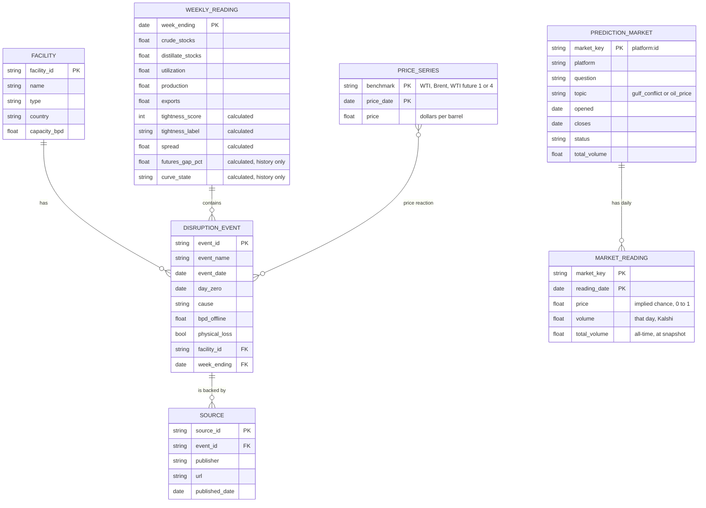

# Crude Market Tightness Monitor

A weekly read on how tight the US oil market is, set beside a global price gauge, for a fuel buyer deciding when to lock in a contract or review a hedge.

Data source: U.S. Energy Information Administration (EIA).

> **This is a market monitoring and research tool. It does not give betting or trading recommendations.** It describes market conditions and how prices behaved in the past. It is a student project and is not investment advice.

## The question

**When is the oil market tight, and how do prices react when supply is disrupted while it is tight?**

Version 1 answers the first half: is the US market tight this week compared with normal for this time of year, and what does the global price gap say? The second half, how prices react to disruptions, is version 2.

## What the monitor shows

1. **US tightness score**, from −3 (loose) to +3 (tight), labelled tight, normal or loose.
2. **Brent minus WTI spread**, a second gauge. Brent is the global benchmark and WTI is the US one, so a wide gap means the world is short while the US is comparatively well supplied.
3. **Five charts.** Crude stocks, distillate stocks and refinery utilization each against their five-year range. The spread over time. US crude production for context.

The two gauges always appear together. The score uses US data only, so on its own it could read "normal" in the middle of a global shortage. In late September 2026 that is exactly what happened: the score read normal while the spread was above $23.

## Method

### 1. Five-year seasonal comparison

Oil inventories rise and fall with the seasons, so a raw number means little. Each week is compared with the same week in earlier years.

1. Label each week-ending Friday with its ISO week number (1 to 53).
2. Take the values for that same week in the **prior five years**. The current year is left out. This matches EIA's own definition of its five-year range.
3. Compute the five-year low, high and average.
4. Compute where this week sits:

```
position   = (value - low) / (high - low)      0 at the five-year low, 1 at the high
pct_vs_avg = (value - average) / average
```

- **Abnormal years are skipped.** 2020 is never used as a comparison year. The range reaches one year further back instead, so it is always built from five values. See "How abnormal years are treated" below.
- **Week 53** is compared with week 52 of the prior years.
- **Missing years.** A week gets no result unless all five prior years have a value.
- **Why not a z-score.** A standard deviation from only five values is unreliable. Position in the range is simpler and more robust.

### 2. The tightness score

| Input | Tight when | +1 point | −1 point |
|---|---|---|---|
| Crude stocks, excluding the strategic reserve | Low | position below 0.25 | position above 0.75 |
| Distillate stocks (diesel and heating oil) | Low | position below 0.25 | position above 0.75 |
| Refinery utilization | High | position above 0.75 | position below 0.25 |

- Score = the sum of the three points. **Tight** at +2 or more, **loose** at −2 or less, otherwise **normal**.
- Weights are equal because there is no evidence yet for any other weighting.
- **Price is left out** because it is the outcome being explained. Putting it in would make "tight markets have high prices" true by construction.
- **Production is left out** because its direction is ambiguous: low output can mean a shortage or weak demand. It is shown as context only.

### 3. The spread

The weekly spread is the average of daily Brent minus WTI over the trading days in each Saturday-to-Friday week. Only days with both prices count. Averaging stops one unusual day from setting the whole week. For example, WTI fell to $85.23 on September 25, 2026 and recovered to $99.37 the next trading day.

## Ontology

Each object type is its own DuckDB table. `weekly_reading`, `price_series`, `prediction_market` and `market_reading` are filled. `facility`, `disruption_event` and `source` wait for the hand-checked event table. Full detail is in [ONTOLOGY.md](ONTOLOGY.md).



- **Calculated properties:** the tightness score and the Brent minus WTI spread on each weekly reading. The futures curve gap and curve state are calculated too, but only through April 5, 2024 (history only).
- **Action (version 2):** "Flag hedge review" fires when the score is tight and a new disruption is logged, and alerts the buyer.

## Data

Seven live EIA series and two history-only futures series. Every route and series ID was confirmed against the live API with `check_routes.py` before use. The script also prints each series' latest date, because a series can stay listed after EIA stops updating it.

| What | EIA series | Units | Route |
|---|---|---|---|
| WTI spot price, Cushing | `RWTC` | $/barrel, daily | `petroleum/pri/spt` |
| Brent spot price | `RBRTE` | $/barrel, daily | `petroleum/pri/spt` |
| Crude stocks excluding SPR | `WCESTUS1` | thousand barrels | `petroleum/stoc/wstk` |
| Distillate fuel stocks | `WDISTUS1` | thousand barrels | `petroleum/stoc/wstk` |
| Refinery utilization | `WPULEUS3` | % of operable capacity | `petroleum/pnp/wiup` |
| Crude production | `WCRFPUS2` | thousand barrels/day | `petroleum/sum/sndw` |
| Crude exports | `WCREXUS2` | thousand barrels/day | `petroleum/move/wkly` |
| WTI futures, contract 1 (history only) | `RCLC1` | $/barrel, daily, ends Apr 5, 2024 | `petroleum/pri/fut` |
| WTI futures, contract 4 (history only) | `RCLC4` | $/barrel, daily, ends Apr 5, 2024 | `petroleum/pri/fut` |

EIA releases the weekly figures on Wednesdays, for the week that ended the previous Friday. Scores start in November 1995, the first week with five full prior years for all three inputs.

## How abnormal years are treated

**Rule: whole years marked abnormal in advance are left out of the five-year range, and the range reaches one year further back so it still holds five values. Single weeks are never removed.** The marked years are 2020 (pandemic) and 2026 (Strait of Hormuz closure). Marking 2026 has no effect until 2027, when it would first enter a five-year window. The list lives in `seasonal.ABNORMAL_YEARS` and was fixed before the backtest was run.

**Why 2020 is left out.** The range is meant to describe normal conditions. In 2020, stocks swelled and refineries ran far below normal. Keeping 2020 lowered the bar for "tight" in every year from 2021 to 2025, mostly through refinery utilization.

**What the choice changed.** These are tight weeks per year; `compare_2020.py` reproduces the full table. Only 2021 to 2025 can differ.

| Year | Tight weeks, 2020 kept (EIA-style range) | Tight weeks, 2020 left out (default) |
|---|---|---|
| 2021 | 24 | 4 |
| 2022 | 50 | 44 |
| 2023 | 36 | 12 |
| 2024 | 39 | 6 |
| 2025 | 46 | 31 |

- 107 of 1,613 scored weeks change label, and 100 of those move from tight to normal.
- Utilization drives most of the change: its average points for 2021 to 2025 fall from +0.57 to −0.02.
- 2022 is tight under either choice.

**Single abnormal weeks stay in.** Winter Storm Uri cut utilization to 56% in February 2021. That week sits at the low end of the utilization range through February 2026 and shows as a dip in the band each February. It is kept, because removing single weeks by judgment would invite cherry-picking.

## Futures curve: history only, ends April 2024

**There is no free live source for the WTI futures curve.**
- EIA's futures route still lists the contracts but stopped updating on April 5, 2024.
- FRED carries only spot prices.
- CME, the exchange, licenses its settlement data, and its pages could not be reached to confirm the terms.

So the curve is a **research comparison for 2010 to April 2024**, not a gauge. It is not shown on the live page.

**What it measures.** The gap between the nearest WTI futures contract and the fourth, as a share of the fourth, averaged over each week (`futures.py`).
- **Backwardation** means the near contract is priced above the later one: buyers pay up for oil now. It is a sign of tightness.
- **Contango** means the near contract is cheaper: oil now is plentiful. It is a sign of looseness.
- A gap within ±1% counts as flat. That band was fixed before looking at results, and a sign-only version is reported too.

**Result: the curve and the score mostly agree.** The curve gives a market-price view and the score a physical-inventory view, and they point the same way far more often than chance. `curve_history.py` reproduces this; it covers 745 weeks from 2010 to April 2024.

| | Score's weeks matching the curve | Base rate across all weeks |
|---|---|---|
| Tight weeks in backwardation | 76% (89% sign only) | 30% (40% sign only) |
| Loose weeks in contango | 90% (98% sign only) | 46% (60% sign only) |
| Opposite readings (tight in contango, or loose in backwardation) | 4% and 1% | |

- **The score is stricter than the curve.** Only 40% of backwardation weeks scored tight, and 44% of contango weeks scored loose. The curve often signals tightness when US stocks are merely normal.
- **Leaving out 2020 changes little.** Loose weeks in contango rise from 90% to 93%.
- **This fits the theory of storage.** When inventories are low, oil for immediate delivery commands a premium over later delivery. Price is still not an input to the score, so the agreement is a check on the score, not circular.
- **Caution.** Tight and loose weeks come in clusters, such as 2014, 2016, 2020 and 2022, so these 745 weeks are far fewer independent observations.

## Prediction markets: what traders priced in (expansion item 3)

`fetch_markets.py` collects public market data from **Polymarket** and **Kalshi** on two topics: the 2026 Gulf conflict, and crude oil price levels. Both sources were confirmed on the live service on October 5, 2026, and neither needs a key for market data. Prediction market prices are traders' implied chances, not facts or forecasts by this project.

**Which markets are included.** The rule was fixed before any prices were looked at (`prediction_markets.py`):
- **Topic.** The title is about the Gulf conflict or crude price levels, by keyword. Elections, leadership, sports, word-mention markets, Lebanon, Gaza, Ukraine and Russia are excluded.
- **Volume.** At least 10,000 in all-time volume: dollars on Polymarket, $1 contracts on Kalshi.
- **Period.** The market closes on or after January 1, 2026, and is open for at least 7 days. One-day markets have no history to compare against.

**What was collected on October 5, 2026**

| Platform | Topic | Markets | Daily readings | From |
|---|---|---|---|---|
| Polymarket | Gulf conflict | 834 | 24,544 | June 2025 |
| Polymarket | Oil price | 332 | 11,457 | Dec 2025 |
| Kalshi | Gulf conflict | 141 | 4,924 | Jan 2026 |
| Kalshi | Oil price | 214 | 5,352 | Mar 2026 |

1,374 of the 1,521 markets have already closed. Their history is kept because rows are only ever added or updated, never deleted.

**Two object types.** `prediction_market` has one row per market, and `market_reading` has one row per market per day.

**One calendar: US Eastern days.** A reading dated D is the market as of the end of D, New York time. The two platforms stamp days differently, and both had to be corrected:
- **Kalshi** stamps each daily candle with its *end* time, which is Eastern midnight, so a candle is filed under the day before its stamp.
- **Polymarket's** built-in daily points are 00:00 UTC snapshots, which is 8 p.m. Eastern the day before. Its prices are therefore fetched hourly, in 14-day ranges, and closed at Eastern midnight.

Tests cover both sides of the daylight-saving change.

**Data gaps**
- **Polymarket daily volume.** Polymarket publishes daily prices but only all-time volume. Each run saves the all-time total, so daily Polymarket volume can be measured only from October 5, 2026 onward.
- **Kalshi.** Kalshi gives daily volume for the full history. 922 Kalshi days have no price because nothing traded that day.

**Privacy.** Only market-level fields are stored, and the tests check that platform address fields never reach a table. No trade-level or account data is requested. Activity is reported in aggregate only.

## Unusual prediction market activity (expansion item 4)

`unusual_activity.py` flags days when prediction market odds or volume moved far more than usual. It reports **aggregate counts and rates only**: it does not identify, name or accuse any account. All rules are in `activity.py` and were fixed before any results were seen.

1. **A market is flagged on a day** when, against its own previous 30 days (at least 14 needed):
   - its odds moved at least 10 percentage points **and** at least 4 times its typical daily move; or
   - its volume was at least 5 times its typical day **and** at least 1,000.

   The last 2 days before a market closes are skipped, because odds jump to 0 or 1 as a question resolves.
2. **A day is unusual for a topic** when the share of that topic's active markets flagged that day is in the top 5% of days. Only days with at least 20 active markets count.
3. **Comparison with events.** For each hand-checked event: was there an unusual day 4 to 2 days before the event date? This is compared with the base rate for any day, and reported with and without the 2026 war episode. Day −1 is skipped because Gulf time runs 7 to 8 hours ahead of New York, so a reaction can land on New York's day −1.

**Results on October 5, 2026**

| | Market-days evaluated | Odds flags | Volume flags |
|---|---|---|---|
| Kalshi, Gulf conflict | 3,151 | 53 | 309 |
| Kalshi, oil price | 3,136 | 67 | 243 |
| Polymarket, Gulf conflict | 12,023 | 347 | no daily volume yet |
| Polymarket, oil price | 6,769 | 265 | no daily volume yet |

- **Gulf conflict.** 13 unusual days out of 245, each with at least 16.1% of active markets flagged. The most unusual were May 23, April 7, February 28 and June 11, 2026.
- **Oil price.** 12 unusual days out of 231, each with at least 20.4% of markets flagged. The most unusual were September 10, April 7, March 9 and February 2, 2026.
- **Event comparison: not run yet.** No events are hand-checked, and unchecked events are never used. The comparison runs automatically once events are marked checked.

**Reading these results.** An unusual day says only that markets moved together more than usual. Activity on or after an event is a reaction, not foresight. That is why the event comparison looks only at days 4 to 2 before, and always against the base rate.

## Backtest: does the score say anything about the next four weeks?

`backtest.py` follows METHODS.md section 3:
- Every week from 2010 is scored using the default range, with 2020 left out.
- Each score is dated to its Wednesday release, never the Friday the week ended, so the test uses only information that was public at the time.
- The return runs from the price on release day to the price four weeks later.

**Result: the score did not predict four-week price changes after tight weeks.**

| 2010 to 2026 | WTI: tight | WTI: loose | WTI: all | Brent: tight | Brent: loose | Brent: all |
|---|---|---|---|---|---|---|
| Weeks | 177 | 167 | 869 | 177 | 167 | 869 |
| Average four-week return | +0.45% | +4.87% | +0.77% | +0.71% | +5.51% | +0.92% |
| Median | +0.10% | +3.13% | +0.92% | −0.68% | +3.81% | +0.67% |
| Hit rate (share of rises) | 50% | 66% | 55% | 46% | 71% | 54% |

**Tight weeks.** After a tight week, prices did no better than after an average week.
- Average returns were within half a point of all weeks, and the hit rates were slightly lower.
- With 2026 left out, tight weeks did slightly *worse* than average: WTI −0.98% against +0.51%.
- **The every-fourth-week check**, which keeps windows from overlapping, gives about 40 tight windows. The tight-minus-all gap changes sign depending on which week the sampling starts on: +0.03%, −1.60%, −0.23% or +0.61% for WTI.
- A typical four-week move is about ±12%, so gaps this size are noise.

**Loose weeks.** After a loose week, prices rose more often than average. This is the more interesting finding, but it rests on very few episodes.
- 2020 alone contributes 37 loose weeks, with an average WTI return of +14.6%: the rebound from the pandemic low.
- Without 2020, loose weeks still averaged +2.1% for WTI (+3.1% for Brent), against +0.55% for all weeks. That is about one typical sampling error.
- Almost all loose weeks fall in four periods: 2010 to 2011, 2016 to 2017, 2020 and 2021. Each was a recovery from a price slump.
- So "loose stocks, then prices rise" is better read as prices recovering after a glut than as a usable signal.

**Checks.** Dating every release to Thursday, to allow for holiday weeks when EIA publishes a day late, gives the same picture: WTI tight +0.50% against all +0.76%. Tight weeks cluster in 2014, 2018, 2022, 2025 and 2026. The 2014 tight weeks were followed by that year's price collapse.

**What this means.** The score describes the physical market. It does not forecast prices, which fits METHODS.md section 7: supply conditions have historically explained less of oil price movement than demand and fear of shortage. The result is reported as found, and the method was not tuned after seeing it.

## Limits

From METHODS.md section 8. Items marked *(later version)* describe parts of the project not built yet.

- The score uses US data only and measures US conditions, not global ones.
- No free live source was found for the futures curve. The curve comparison is history only and ends April 5, 2024.
- Prediction market prices reflect what traders on two platforms were willing to pay. They are not probabilities this project endorses. Polymarket daily volume exists only from October 5, 2026.
- Unusual-activity days show markets moving together. They do not show who traded or why, and activity on or after an event is a reaction. Days near the 20-market minimum rest on small counts.
- Weekly figures are estimates and are sometimes revised. The backtest uses revised data, not the first figures people saw at the time.
- Forward windows overlap, which overstates how much evidence there is. The every-fourth-week check is reported alongside.
- Tight and loose weeks come in clusters, so a handful of episodes drive the backtest result.
- The event table is small, and other news moves prices on the same days. *(Event study: version 2)*
- The 2026 Strait of Hormuz episode is far larger than any other event and dominates averages. Results are shown with and without it. *(Event study: version 2)*
- The event table was drafted with AI assistance and hand-checked. The accuracy rate is reported. *(Version 2. Not yet checked.)*
- The tool describes how prices reacted in the past. It does not forecast when disruptions happen or what prices will do.
- This is a market monitoring and research tool, not betting or trading advice. It is a student project and is not investment advice.

## Run it yourself

You need Python 3.13 and a free EIA API key from https://www.eia.gov/opendata/register.php.

```bash
python3 -m venv .venv
.venv/bin/pip install -r requirements.txt
```

Create a file named `.env` in the project folder with one line, `EIA_API_KEY=your_key`. Git ignores this file, so the key never gets committed.

```bash
.venv/bin/python check_routes.py   # confirm every series is on its route
.venv/bin/python fetch.py          # download the seven series into DuckDB
.venv/bin/python calculate.py      # five-year comparison, score, and spread
.venv/bin/python backtest.py       # backtest (METHODS.md section 3)
.venv/bin/python curve_history.py  # futures curve vs score, history only
.venv/bin/python fetch_markets.py  # prediction market odds (no key needed); re-run daily, about 3 minutes
.venv/bin/python unusual_activity.py  # unusual activity, aggregate only
.venv/bin/streamlit run app.py     # open the page
.venv/bin/python -m unittest discover -s tests -t .   # run the tests
```

Re-run `fetch.py` and `calculate.py` after each Wednesday EIA release.

## Files

| File | What it does |
|---|---|
| `eia.py` | Reads the key from `.env`, calls the EIA API, pages through long series |
| `check_routes.py` | Confirms each series ID exists on its route before anything is fetched |
| `db.py` | The DuckDB schema: one table per ontology object type |
| `fetch.py` | Downloads the seven live series and the two history-only futures series |
| `seasonal.py` | Five-year comparison (METHODS.md section 1) |
| `score.py` | Tightness score and weekly spread (METHODS.md section 2) |
| `calculate.py` | Runs the comparison, score, and spread and saves them |
| `compare_2020.py` | Shows what leaving 2020 out of the range changes |
| `backtest.py` | Four-week price changes after tight, loose, and all weeks |
| `futures.py` | Futures curve gap and backwardation/contango state (history only) |
| `curve_history.py` | How often the curve agreed with the score, 2010 to April 2024 |
| `prediction_markets.py` | Polymarket and Kalshi clients and the market selection rule |
| `fetch_markets.py` | Saves prediction market odds; add or update only, never delete; re-runs fetch only recent days |
| `activity.py` | Unusual-activity rules: market-day flags, unusual topic-days, event window |
| `unusual_activity.py` | Aggregate report of unusual days and the comparison with hand-checked events |
| `app.py` | The Streamlit page |
| `tests/` | Tests for every calculation: schema, API paging, comparison, score, backtest, futures curve |

## Roadmap

| Version | Adds |
|---|---|
| 1 | This monitor |
| 1.5 | Backtest (done, results above) |
| 2 | Supply Disruption Event Study: hand-checked event table, price reactions over 1, 5 and 20 days, scenario lookup, map |
| 3 | Rebuild in Palantir Foundry |
